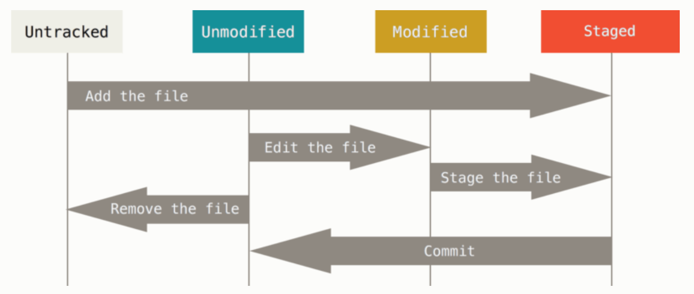

# `git status`



- 워킹 디렉토리 파일은 크게 **Untracked, Tracked** 두 가지 상태로 나뉜다.
- **Tracked**
    - 파일 수정이 발생해 git이 이 변경 사항을 감지해 사용자에게 알려주는 것처럼 파일을 추적하는 상태
- **Untracked**
    - 파일을 저장소에 저장할 필요가 없어 git이 신경쓰지 않아도 되는 상태
        - 파일을 새로 만들 경우 **Untracked** 상태로 잡히게 된다.
        
        ```bash
        touch 1
        
        git status
        
        Untracked files:
          (use "git add <file>..." to include in what will be committed)
        	1
        ```
        

---

### Tracked 상태의 파일

- Tracked 상태의 파일들은 크게 **Unmodified, Modified, Staged 세 개의 상태**로 나뉘어진다.
- **Staged**
    - staging area에 있는 파일의 상태를 의미한다.
    - `git add <filename>` 을 실행하면 `<filename>` 은 **staged** 상태이다.
    - 만약 unstaging 을 하려면 `git restore --staged <filename>` 을 하면된다.
    
    ```bash
    git add 1
    git status
    
    On branch master
    Your branch is up to date with 'origin/master'.
    
    Changes to be committed:
      (use "git restore --staged <file>..." to unstage)
    	new file:   1
    ```
    
- **Unmodified**
    - staging area에 있는 파일을 커밋하면 상태는 **Unmodified**가 된다.
    - Unmodified 상태의 파일은 **화면에 출력되지 않는다.**
    
    ```bash
    git commit -m "add 1"
    git status
    
    On branch master
    Your branch is ahead of 'origin/master' by 1 commit.
      (use "git push" to publish your local commits)
    ```
    
- **Modified**
    - **Unmodified** 상태의 파일을 수정할 경우 **Modified** 상태의 파일이 된다.
    
    ```bash
    echo "edit 1" >> 1
    git status
    
    On branch master
    Your branch is ahead of 'origin/master' by 1 commit.
      (use "git push" to publish your local commits)
    
    Changes not staged for commit:
      (use "git add <file>..." to update what will be committed)
      (use "git restore <file>..." to discard changes in working directory)
    	modified:   1
    ```